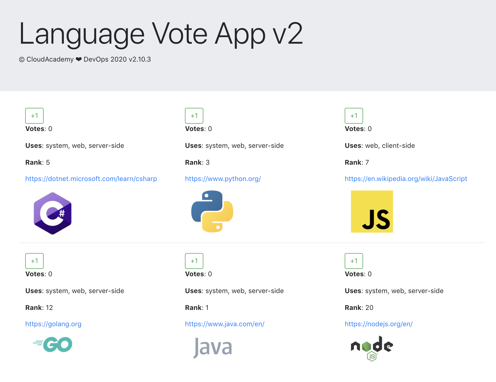

### Exercise 4

Create an advanced AWS VPC to host a fully functioning cloud native application.



The VPC will span 2 AZs, and have both public and private subnets. An internet gateway and NAT gateway will be deployed into it. Public and private route tables will be established. An application load balancer (ALB) will be installed which will load balance traffic across an auto scaling group (ASG) of Nginx web servers installed with the cloud native application frontend and API. A database instance running MongoDB will be installed in the private zone. Security groups will be created and deployed to secure all network traffic between the various components.

For demonstration purposes only - both the frontend and the API will be deployed to the same set of ASG instances - to reduce running costs.

<https://github.com/cloudacademy/terraform-aws/tree/main/exercises/exercise4>


The auto scaling web application layer bootstraps itself with both the [Frontend](https://github.com/cloudacademy/voteapp-frontend-react-2020) and [API](https://github.com/cloudacademy/voteapp-api-go) components by pulling down their **latest** respective releases from the following repos:

- Frontend: <https://github.com/cloudacademy/voteapp-frontend-react-2020/releases/latest>

- API: <https://github.com/cloudacademy/voteapp-api-go/releases/latest>

The bootstrapping process for the [Frontend](https://github.com/cloudacademy/voteapp-frontend-react-2020) and [API](https://github.com/cloudacademy/voteapp-api-go) components is codified within a ```template_cloudinit_config``` block located in the application module's [main.tf](./modules/application/main.tf) file:

```terraform
data "template_cloudinit_config" "config" {
  gzip          = false
  base64_encode = false

  #userdata
  part {
    content_type = "text/x-shellscript"
    content      = <<-EOF
    #! /bin/bash
    apt-get -y update
    apt-get -y install nginx
    apt-get -y install jq

    ALB_DNS=${aws_lb.alb1.dns_name}
    MONGODB_PRIVATEIP=${var.mongodb_ip}
    
    mkdir -p /tmp/cloudacademy-app
    cd /tmp/cloudacademy-app

    echo ===========================
    echo FRONTEND - download latest release and install...
    mkdir -p ./voteapp-frontend-react-2020
    pushd ./voteapp-frontend-react-2020
    curl -sL https://api.github.com/repos/cloudacademy/voteapp-frontend-react-2020/releases/latest | jq -r '.assets[0].browser_download_url' | xargs curl -OL
    INSTALL_FILENAME=$(curl -sL https://api.github.com/repos/cloudacademy/voteapp-frontend-react-2020/releases/latest | jq -r '.assets[0].name')
    tar -xvzf $INSTALL_FILENAME
    rm -rf /var/www/html
    cp -R build /var/www/html
    cat > /var/www/html/env-config.js << EOFF
    window._env_ = {REACT_APP_APIHOSTPORT: "$ALB_DNS"}
    EOFF
    popd

    echo ===========================
    echo API - download latest release, install, and start...
    mkdir -p ./voteapp-api-go
    pushd ./voteapp-api-go
    curl -sL https://api.github.com/repos/cloudacademy/voteapp-api-go/releases/latest | jq -r '.assets[] | select(.name | contains("linux-amd64")) | .browser_download_url' | xargs curl -OL
    INSTALL_FILENAME=$(curl -sL https://api.github.com/repos/cloudacademy/voteapp-api-go/releases/latest | jq -r '.assets[] | select(.name | contains("linux-amd64")) | .name')
    tar -xvzf $INSTALL_FILENAME
    #start the API up...
    MONGO_CONN_STR=mongodb://$MONGODB_PRIVATEIP:27017/langdb ./api &
    popd

    systemctl restart nginx
    systemctl status nginx
    echo fin v1.00!

    EOF    
  }
}
```

#### ALB Target Group Configuration

The ALB will configured with a single listener (port 80). 2 target groups will be established. The frontend target group points to the Nginx web server (port 80). The API target group points to the custom API service (port 8080).


#### Project Structure

```
├── main.tf
├── modules
│   ├── application
│   │   ├── main.tf
│   │   ├── outputs.tf
│   │   └── vars.tf
│   ├── bastion
│   │   ├── main.tf
│   │   ├── outputs.tf
│   │   └── vars.tf
│   ├── network
│   │   ├── main.tf
│   │   ├── outputs.tf
│   │   └── vars.tf
│   ├── security
│   │   ├── main.tf
│   │   ├── outputs.tf
│   │   └── vars.tf
│   └── storage
│       ├── install.sh
│       ├── main.tf
│       ├── outputs.tf
│       └── vars.tf
├── outputs.tf
├── terraform.tfvars
└── variables.tf
```

#### TF Variable Notes

- `workstation_ip`: The Terraform variable `workstation_ip` represents your workstation's external perimeter public IP address, and needs to be represented using CIDR notation. This IP address is used later on within the Terraform infrastructure provisioning process to lock down SSH access on the instance(s) (provisioned by Terraform) - this is a security safety measure to prevent anyone else from attempting SSH access. The public IP address will be different and unique for each user - the easiest way to get this address is to type "what is my ip address" in a google search. As an example response, lets say Google responded with `202.10.23.16` - then the value assigned to the Terraform `workstation_ip` variable would be `202.10.23.16/32` (note the `/32` is this case indicates that it is a single IP address).

- `key_name`: The Terraform variable `key_name` represents the AWS SSH Keypair name that will be used to allow SSH access to the Bastion Host that gets created at provisioning time. If you intend to use the Bastion Host - then you will need to create your own SSH Keypair (typically done within the AWS EC2 console) ahead of time.

  - The required Terraform `workstation_ip` and `key_name` variables can be established multiple ways, one of which is to prefix the variable name with `TF_VAR_` and have it then set as an environment variable within your shell, something like:

  - **Linux**: `export TF_VAR_workstation_ip=202.10.23.16/32` and `export TF_VAR_key_name=your_ssh_key_name`

  - **Windows**: `set TF_VAR_workstation_ip=202.10.23.16/32` and `set TF_VAR_key_name=your_ssh_key_name`

- Terraform environment variables are documented here:
[https://www.terraform.io/cli/config/environment-variables](https://www.terraform.io/cli/config/environment-variables)

